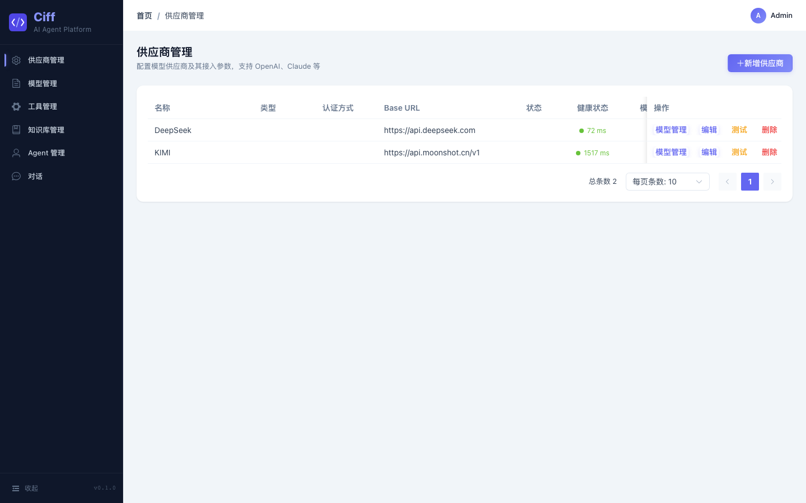
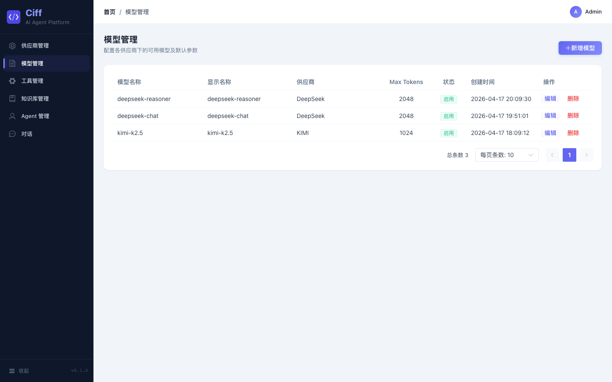
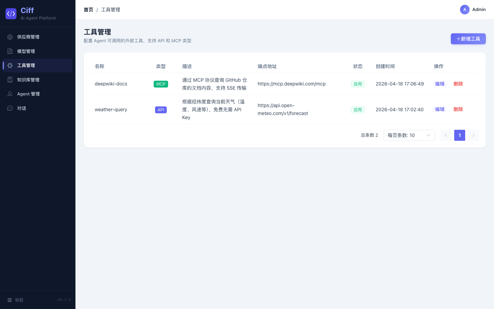
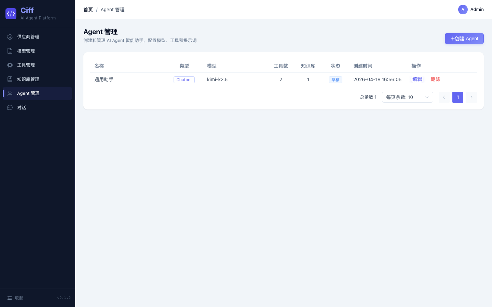
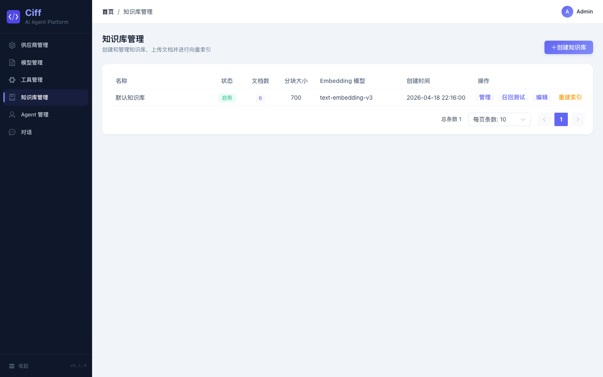
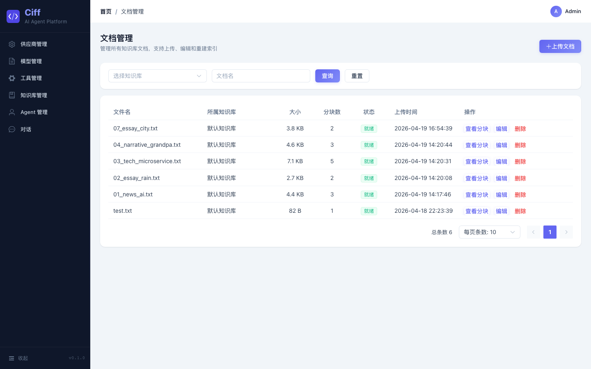
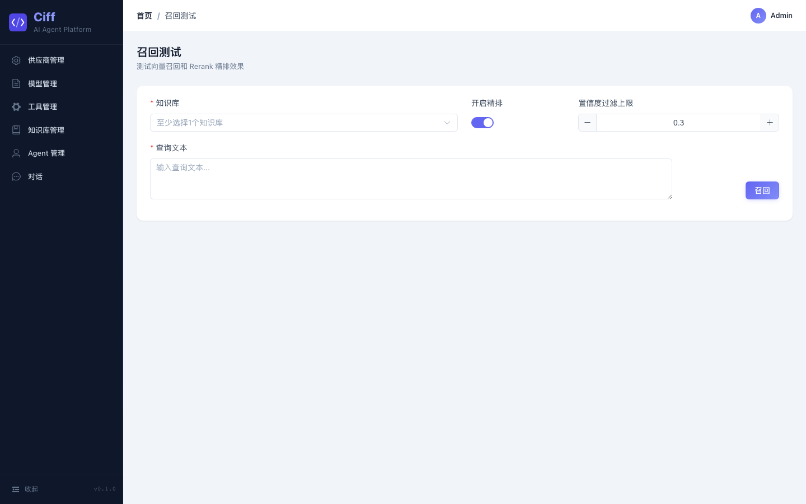
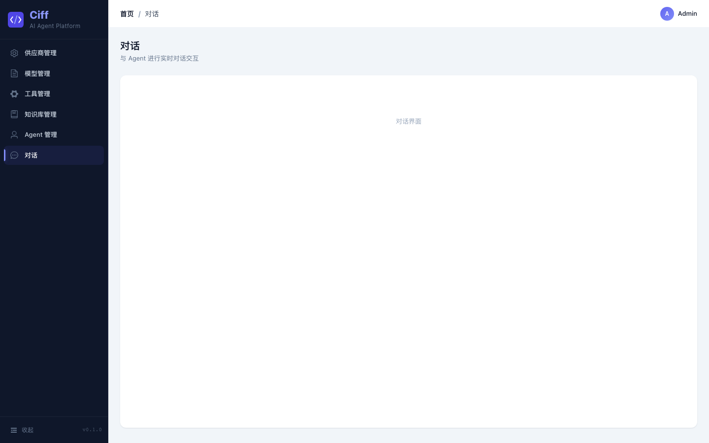

# Ciff

> **C**ode **I**t **F**or **F**uture

简化版 Dify，面向小团队的 AI Agent 开发与运行平台。

## V1 功能范围

| 功能 | 说明 |
|------|------|
| Agent 智能助手 | 工具调用 + 多轮对话，核心形态 |
| Chatbot 对话应用 | 基础对话，最高频入口 |
| Workflow 工作流 | JSON 配置，线性步骤 + 条件分支，不做可视化拖拽 |
| 模型供应商适配 | 统一接口，OpenAI / Claude / 本地模型 |
| 知识库 RAG | TXT 文档，固定长度分块，PGVector |
| 自定义工具 / API | Agent 可调用外部接口 |
| Web + API 发布 | 对话界面 + REST API |
| 日志追踪 | 完整调用链，用于调试排错 |

## 技术栈

**后端** — JDK 17 / Spring Boot 3.3 / MyBatis-Plus / MySQL / Redis (Redisson) / Spring AI / Resilience4j

**前端** — Vue 3 / TypeScript / Element Plus / Vite / SSE

**基础设施** — Nginx + Docker Compose

## 项目结构

```
ciff/
├── ciff-common/      # 公共模块（工具类、异常、DTO、配置）
├── ciff-provider/    # 模型供应商管理
├── ciff-mcp/         # MCP 工具管理与调用
├── ciff-knowledge/   # 知识库与 RAG
├── ciff-agent/       # Agent 管理与编排
├── ciff-workflow/    # 工作流编排与执行
├── ciff-chat/        # 对话引擎（顶层编排）
├── ciff-app/         # Spring Boot 启动模块
└── rules/            # 编码规范与设计文档
```

## 产品展示

<table>
  <tr>
    <td align="center"><b>供应商管理</b></td>
    <td align="center"><b>模型管理</b></td>
  </tr>
  <tr>
    <td></td>
    <td></td>
  </tr>
  <tr>
    <td align="center"><b>工具管理</b></td>
    <td align="center"><b>Agent 管理</b></td>
  </tr>
  <tr>
    <td></td>
    <td></td>
  </tr>
  <tr>
    <td align="center"><b>知识库管理</b></td>
    <td align="center"><b>文档管理</b></td>
  </tr>
  <tr>
    <td></td>
    <td></td>
  </tr>
  <tr>
    <td align="center"><b>召回测试</b></td>
    <td align="center"><b>对话页面</b></td>
  </tr>
  <tr>
    <td></td>
    <td></td>
  </tr>
</table>

## 开发进度

### Phase 1: 基础框架搭建 (2026-04-13 ~ 2026-04-15)

- [x] Maven 多模块工程骨架（8 子模块，分层依赖）
- [x] 统一响应 `Result<T>` / 分页 `PageResult<T>`
- [x] 统一异常处理 `BizException` + `ErrorCode` + `GlobalExceptionHandler`
- [x] MyBatis-Plus 配置（分页插件、自动填充 createTime/updateTime、逻辑删除）
- [x] Redis 配置（Redisson + JSON 序列化 + RedisUtil）
- [x] Spring Boot 启动类 + application.yml
- [x] 项目规范文档（模块结构、数据库、接口、编码、测试）
- [x] 健康检查接口 `GET /api/v1/health`
- [x] Flyway 数据库迁移管理
- [x] 请求日志拦截 + LLM 日志脱敏

### Phase 2: Provider 模型供应商 (2026-04-15 ~ 2026-04-17)

- [x] 供应商 CRUD（支持 OpenAI / Claude / 本地模型）
- [x] 模型管理 CRUD + 默认参数配置
- [x] LLM HTTP 客户端（WebClient + Reactor Netty，同步 + SSE 流式）
- [x] Claude 客户端适配 + LLM 客户端工厂抽象
- [x] 供应商健康检查定时任务
- [x] Resilience4j 熔断保护
- [x] LLM 调用超时配置（四级超时策略）
- [x] API Key 加密存储

### Phase 3: Agent / MCP / Knowledge 模块 (2026-04-17 ~ 2026-04-19)

- [x] MCP 工具管理 CRUD + Facade 层
- [x] Agent 管理 CRUD + Agent-Tool 绑定关系
- [x] Agent 聚合控制器（模型校验、统一入口）
- [x] 知识库 CRUD + PGVector 双数据源配置
- [x] 文档管理（上传、分块、向量化、定时处理调度）
- [x] 本地文件存储 + TXT 固定长度分块
- [x] 缓存层支持（Provider / Agent 详情缓存）

### Phase 4: 前端界面 (2026-04-17 ~ 进行中)

- [x] 前端工程初始化（Vue 3 + TypeScript + Element Plus + Vite）
- [x] 设计系统与公共组件库（CiffTable / CiffFormDialog / PageHeader / TopBar）
- [x] 供应商管理页面
- [x] 模型管理页面
- [x] 工具管理页面
- [x] Agent 管理页面
- [ ] Chat 对话页面（基础框架已有）

### 待开发

- [ ] Workflow 引擎（JSON 配置，线性步骤 + 条件分支）
- [ ] Chat 对话引擎（顶层编排，串联 Agent / 知识库 / 工具）
- [ ] 知识库 RAG 检索集成（向量查询接入对话链路）
- [ ] Docker Compose 部署
- [ ] Nginx 反向代理 + SSE 透传配置
